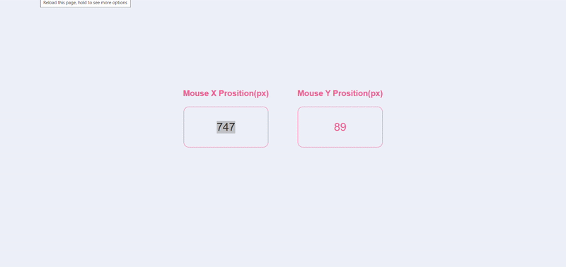
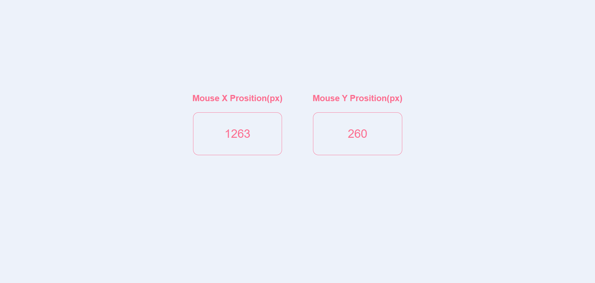

# 🖱️ CursorTrack – Real-Time Mouse Position Tracker

**CursorTrack** is a front-end project that captures and displays the real-time X and Y coordinates of your mouse cursor on the screen. Built using HTML5, CSS3, and JavaScript, it’s designed as an educational project to demonstrate DOM events, live updating UI, and responsive interactivity.

- 
👨‍💻 Author
Virendra D. Verma
<a href="https://www.linkedin.com/in/dharmendraverma95/" target="_blank">🧑‍💻 LinkedIn Profile </a> | <a href="https://www.behance.net/dhirukumar" target="_blank">🧑‍💻 Behance Profile </a>

-

---

## 📌 Features

- 📍 Real-time tracking of mouse X and Y coordinates
- 📦 Clean and minimal layout
- 🎯 Fully responsive and lightweight
- 🔁 Smooth updates without page reloads
- 🧠 Built entirely with HTML, CSS, and vanilla JavaScript

---

## 💻 Technologies Used

- **HTML5** – semantic markup
- **CSS3** – basic styling and hover effects
- **JavaScript** – dynamic event handling (`mousemove`, DOM updates)

---

## 🗂️ Folder Structure

cursortrack/
├── index.html
├── style.css
└── README.md

👉 Desktop Design 
 
👉 Desktop Design 
